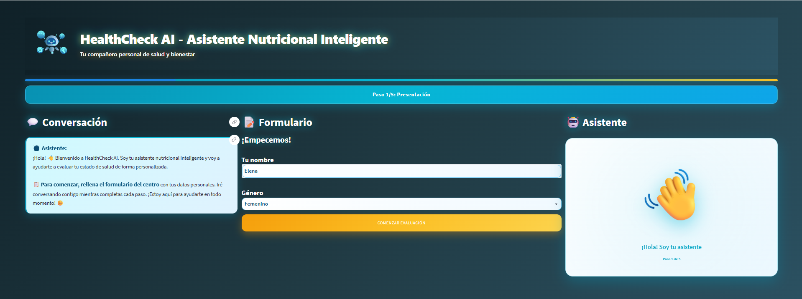
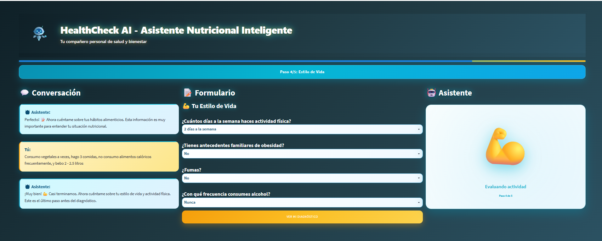
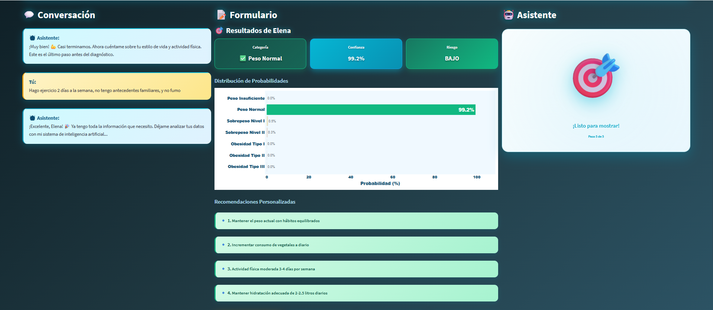

# 📝 Obesity Risk Classification MVP
<div align="center">
 


[](TU_URL_AQUI)
 
**Sistema completo de clasificación de niveles de obesidad mediante Machine Learning**
 
[Demo en Vivo](https://mi-app-obesidad.onrender.com/)  • [Instalación](#-instalación-y-uso)
 
</div>
 
---

## 🚀 Descripción del Proyecto

Sistema completo de **clasificación multiclase de niveles de obesidad** basado en hábitos físicos y antecedentes personales. Este proyecto utiliza modelos avanzados de Machine Learning, siendo **XGBoost** el seleccionado por su rendimiento superior, para predecir el estado nutricional de una persona desde peso insuficiente hasta obesidad tipo III.
### ✨ Características principales:
- 🔍 **Análisis Exploratorio Completo**: Visualizaciones interactivas y análisis profundo de tendencias
- 🤖 **Múltiples Modelos ML**: Comparación entre KNN, Random Forest, Decision Tree y XGBoost
- 🎨 **Interfaz Moderna y Mejorada**: Aplicación web intuitiva con componentes UI actualizados
- 🐳 **Contenerización Completa**: Docker + Docker Compose para despliegue consistente
- ☁️ **En Producción**: Desplegado en Render con acceso 24/7
- 📊 **Visualizaciones Dinámicas**: Gráficos interactivos con Plotly, Altair y animaciones Lottie
- ⚡ **Gestión Moderna**: UV como gestor de paquetes para instalación ultrarrápida
 
---

## 🚀 Demo en Vivo
 
Prueba la aplicación ahora mismo sin necesidad de instalar nada:
 
**🌐 [HealthCheck AI](https://mi-app-obesidad.onrender.com/)**

 <div align="center">
  
  &nbsp;&nbsp;
  
  
</div>


 
> **Nota**: Si la aplicación está inactiva, puede tardar ~30 segundos en iniciar (limitación del tier gratuito de Render).
 
---

## 🛠️ Stack Tecnológico

| Categoría | Herramientas |
|-----------|--------------|
| **Lenguaje** | Python 3.11+ |
| **Gestión de Paquetes** | UV (ultrarrápido) |
| **Análisis de Datos** | Pandas, NumPy |
| **Visualización** | Plotly, Matplotlib, Seaborn, Altair |
| **Machine Learning** | Scikit-learn, XGBoost, Joblib |
| **Interfaz** | Streamlit, Streamlit-lottie |
| **Contenerización** | Docker, Docker Compose |
| **Despliegue** | Render (Cloud) |
| **Desarrollo** | Jupyter Notebooks |
 
---

## 📦 Instalación y Uso

### 🌐 Opción 1: Usar la Demo en Línea (Recomendado)
 
Simplemente visita **[HealthCheck AI](https://mi-app-obesidad.onrender.com/)** y comienza a usar la aplicación inmediatamente.
 
### 🐳 Opción 2: Usando Docker Compose (Recomendado para Local)
 
```bash
# 1. Clonar el repositorio
git clone https://github.com/Bootcamp-IA-P6/p7_g1_multiclase.git
cd p7_g1_multiclase
 
# 2. Levantar los servicios con Docker Compose
docker-compose up --build
 
# 3. Acceder a la aplicación
# La app estará disponible en: http://localhost:8501
```
 
Para detener la aplicación:
```bash
docker-compose down
```
 
### 🐋 Opción 3: Usando Docker
 
```bash
# 1. Construir la imagen
docker build -t obesidad-app .
 
# 2. Ejecutar el contenedor
docker run -p 8501:8501 obesidad-app
```
 
Accede a la app en: **http://localhost:8501**
 
### 💻 Opción 4: Instalación Local con UV
 
```bash
# 1. Instalar UV (si no lo tienes)
curl -LsSf https://astral.sh/uv/install.sh | sh
# O en Windows con PowerShell:
# powershell -c "irm https://astral.sh/uv/install.ps1 | iex"
 
# 2. Clonar el repositorio
git clone https://github.com/Bootcamp-IA-P6/p7_g1_multiclase.git
cd p7_g1_multiclase
 
# 3. Sincronizar dependencias (ultrarrápido con UV)
uv sync
 
# 4. Ejecutar la aplicación
uv run streamlit run app.py
```
 
---

## 📊 Estructura del Proyecto

```
📁 p7_g1_multiclase/
├── 📂 .github/            # Configuración de GitHub
├── 📂 .venv/              # Entorno virtual (generado)
├── 📂 assest/             # Recursos estáticos (imágenes, animaciones)
├── 📂 data/               # Conjuntos de datos (raw y procesados)
├── 📂 docs/               # Documentación adicional
├── 📂 models/             # Modelos entrenados (.joblib)
├── 📂 notebooks/          # Jupyter Notebooks (EDA y entrenamiento)
├── 📂 report/             # Reportes ejecutivos en PDF
├── 📄 .dockerignore       # Archivos excluidos de Docker
├── 📄 .env                # Variables de entorno (local)
├── 📄 .gitignore          # Archivos excluidos de Git
├── 📄 .python-version     # Versión de Python del proyecto
├── 📄 app.py              #  Aplicación principal de Streamlit
├── 📄 docker-compose.yml  # Configuración de Docker Compose
├── 📄 dockerfile          # Configuración de Docker
├── 📄 pyproject.toml      # Configuración del proyecto y dependencias
├── 📄 uv.lock             # Lock file de UV
└── 📄 README.md           # Esta documentación
```
 

-----

## 🤖 Modelado y Resultados

| Modelo | Accuracy | F1-Score | Características | Resultado |
|--------|----------|----------|-----------------|-----------|
| **K-Nearest Neighbors (KNN)** | ~88% | ~86% | Simple, sensible a outliers | Baseline sólido |
| **Decision Tree Classifier** | ~92% | ~91% | Interpretable, riesgo de overfitting | Buen desempeño |
| **Random Forest** | ~94% | ~93% | Robusto, ensemble learning | Muy competitivo |
| **XGBoost** ⭐ | **~96%** | **~95%** | Gradient boosting, óptimo | **Seleccionado** |

### 🏆 ¿Por qué XGBoost?
 
- ✅ **Mayor precisión**: 96% de accuracy en validación
- ✅ **Mejor F1-Score**: Equilibrio perfecto entre precisión y recall
- ✅ **Robustez**: Excelente capacidad de generalización
- ✅ **Optimización**: Afinado mediante GridSearchCV
- ✅ **Manejo de clases**: Ideal para problemas multiclase desbalanceados
- ✅ **Rendimiento**: Rápido en predicción e inferencia

### 📈 Proceso de Selección
 
1. **Entrenamiento inicial** de todos los modelos con configuración por defecto
2. **Validación cruzada** (K-Fold) para evaluar estabilidad
3. **Optimización de hiperparámetros** en los mejores candidatos
4. **Evaluación final** con métricas múltiples (Accuracy, F1, Precision, Recall)
5. **Selección de XGBoost** por desempeño superior consistente
 
> 💡 **Tip**: Todos los modelos están serializados en `models/` para comparación y uso.
 
---
 
## 📊 Funcionalidades de la Aplicación
 
### 🎯 Módulo de Predicción
- Formulario interactivo para ingresar datos del usuario
- Predicción en tiempo real del nivel de obesidad
- Visualización de probabilidades por clase
- Recomendaciones personalizadas
 
### 📈 Análisis Exploratorio (EDA)
- Distribución de niveles de obesidad en el dataset
- Correlaciones entre variables
- Análisis de importancia de características
- Gráficos interactivos con Plotly y Altair
 
### 🔬 Comparación de Modelos
- Métricas de rendimiento de todos los modelos
- Matrices de confusión interactivas
- Curvas ROC multiclase
- Análisis de errores
 
### 📉 Visualizaciones Disponibles
- 📊 Histogramas y distribuciones
- 🔄 Matrices de correlación
- 📈 Gráficos de barras y líneas
- 🎯 Feature importance
- 🌈 Heatmaps interactivos

## 🧪 Uso de la Aplicación
 
### Paso a Paso
 
1. **Accede a la aplicación** (web o local)

2. **Ingresa los datos**:
   - Información demográfica (edad, género, altura, peso)
   - Hábitos alimenticios
   - Frecuencia de actividad física
   - Consumo de agua y alcohol
   - Historial familiar
3. **Obtén resultados instantáneos**:
   - Clasificación del nivel de obesidad
   - Gráficos explicativos
   - Recomendaciones de salud
 ## 🧠 Variables del Modelo
 
El modelo utiliza las siguientes características para la predicción:
 
### 📋 Variables de Entrada
 
| Variable | Descripción | Tipo |
|----------|-------------|------|
| **Edad** | Edad del individuo | Numérico |
| **Género** | Masculino/Femenino | Categórico |
| **Altura** | Altura en metros | Numérico |
| **Peso** | Peso en kilogramos | Numérico |
| **Historial Familiar** | Antecedentes de sobrepeso | Binario |
| **FAVC** | Consumo frecuente de alimentos calóricos | Binario |
| **FCVC** | Frecuencia de consumo de vegetales | Numérico |
| **NCP** | Número de comidas principales | Numérico |
| **CAEC** | Consumo de comida entre comidas | Categórico |
| **SMOKE** | Fumador | Binario |
| **CH2O** | Consumo diario de agua | Numérico |
| **FAF** | Frecuencia de actividad física | Numérico |
| **CALC** | Consumo de alcohol | Categórico |
 
### 🎯 Clases de Salida
 
El modelo clasifica en **7 niveles**:
1. 🟢 Peso Insuficiente
2. 🟢 Peso Normal
3. 🟡 Sobrepeso Nivel I
4. 🟡 Sobrepeso Nivel II
5. 🟠 Obesidad Tipo I
6. 🔴 Obesidad Tipo II
7. 🔴 Obesidad Tipo III
 

-----

## 👥 Contribuyentes

Este proyecto fue desarrollado por el **Grupo 1 - Bootcamp IA P6**:

| Nombre | Rol |
| :--- | :--- |
| **Gema Yébenes Caballero** | Scrum Master |
| **José Julio Ramírez y Sánchez-Escobar** | Data Steward |
| **Andrés Torrez** | IA Developer |
| **Juan Manuel Iriondo Ortega** | Data Analyst |
| **Mar Izquierdo Vaquer** | Product Owner |

-----

> [\!IMPORTANT]
> Este proyecto fue realizado como parte del entregable **P7** del Bootcamp de Inteligencia Artificial.

<div align="center">
 
**⭐ Si te ha gustado este proyecto, dale una estrella en GitHub ⭐**
 
[](https://github.com/Bootcamp-IA-P6/p7_g1_multiclase)
 
Hecho con ❤️ y ☕ por el Grupo 1
 
</div>
